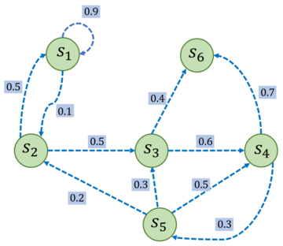

# 马尔可夫决策过程
马尔科夫决策过程抱恨状态信息以及状态之间的转移机制。
如果要用强化学习去解决一个实际问题，首先要将实际问题抽象成一个马尔科夫决策过程。

## 马尔可夫过程
### 随机过程
随机过程的研究对象是**随时间变化的**随机现象，或称**动态随机变量**，例如天气随时间的变化。
随机过程是对现实生活中动态随机现象的**建模**

在随机过程中，随机现象在某时刻$t$的取值是一个向量随机变量，用$S_t$表示，称为随机现象在$t$时刻的状态。所有可能的状态组成该随机现象的的状态集合$S$。
在某时刻$t$的状态$S_t$往往取决于之前时刻的状态$S_\tau$，则$S_{t+1}$的概率表述为：$P(S_{t+1}|S_1, S_2, ..., S_t)$

从状态$S_t$到状态$S_{t+1}$的演变就是一个动态随机现象
也就是说：**随机现象是状态的变化过程**
与静态随机现象不同，动态随机现象描述的是**在一个时序上，从某一状态到另一个状态的演变**，或是由时间序列串起来的状态序列；而静态随机现象描述的则是**某一状态的发生**。

**综上所述，取决于此前状态的条件概率$P(S_{t+1}|S_1, S_2, ..., S_t)$正是随机过程模型的核心。**

### 马尔可夫性质
当且仅当**某时刻的状态只取决于上一时刻的状态**时，一个随机过程被称为具有马尔可夫性质。用公式表述如下：
$$P(S_{t+1}|S_t) = P(S_{t+1}|S_t, ..., S_1)$$
马尔可夫性质可以大幅化简计算，各个时刻的状态链式相连。

### 马尔可夫过程
具有马尔可夫性质的随机过程称为马尔可夫过程，又称马尔可夫链。
通常使用一个元组$<S,P>$来描述马尔可夫过程，其中$S$是有限数量的状态集合，$P$是状态转移矩阵。

假设有n个状态，$S = \{s_1, s_2, ..., s_n\}$则：
$$P = \begin{bmatrix}P(s_1|s_1) &... &P(s_n|s_1) \\ \vdots &\ddots &\vdots \\ P(s_1|s_n) &... &P(s_n|s_n)\end{bmatrix}$$
描述每两个状态对之间的状态转移概率。
从某个状态出发，到达其他所有状态的概率之和为1，即P矩阵的每一行各元素之和为1。

#### 马尔可夫过程示例

> 其中每个绿色圆圈表示一个状态，每个状态都有一定概率（包括概率为0）转移到其他状态，其中$s_6$通常被称为**终止状态**（terminal state），因为它不会再转移到其他状态，可以理解为它永远以概率1转移到自己。状态之间的虚线箭头表示状态的转移，箭头旁的数字表示该状态转移发生的概率。从每个状态出发转移到其他状态的概率总和为1。例如，$s_1$有90%概率保持不变，有 10%概率转移到$s_2$，而在$s_2$又有50%概率回到$s_1$，有50%概率转移到$s_3$。
> 对应的状态转移矩阵如下：
> $$P = \begin{bmatrix} 0.9 &0.1 &0 &0 &0 &0 \\ 0.5 &0 &0.5 &0 &0 &0 \\ 0 &0 &0 &0.6 &0 &0.4 \\ 0 &0 &0 &0 &0.3 &0.7 \\ 0 &0.2 &0.3 &0.5 &0 &0 \\ 0 &0 &0 &0 &0 &1 \end{bmatrix}$$

给定一个马尔可夫过程，我们可以从某一个状态出发，通过状态转移矩阵生成一个到达终止状态的状态**序列**(episode)，这个生成序列的过程就叫**采样**(sampling)。

## 马尔可夫奖励过程

### 回报

### 价值函数

## 马尔可夫决策过程

### 策略

### 状态价值函数

### 动作价值函数

### 贝尔曼期望方程

## 蒙特卡洛方法

## 占用度量

## 最优策略

### 贝尔曼最优方程

## 总结