# Linux文件操作
## 文件与目录
学习以下命令：
```bash
pwd
ls
ls -la
mkdir -p ~/linux-git-lab/data
cd ~/linux-git-lab
touch notes.txt
cp notes.txt ./data/notes-copy.txt
mv data/notes-copy.txt data/px4-notes.txt
find . -maxdepth 2 -type f
```
1. `pwd`：查看当前位置
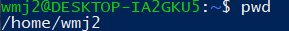
2. `ls`：列出当前目录内容(list)
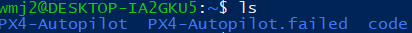
3. `ls -la`：显示所有内容和详细信息，包括以`.`开头的隐藏文件，权限、所有者、大小和修改时间。
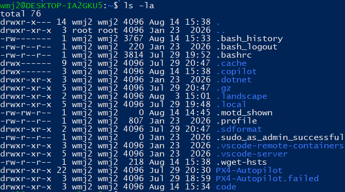
4. `mkdir -p`，`cd`：递归创建目录和切换当前工作目录
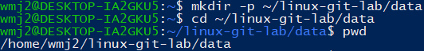
`-p`保证当我们要创建的目录上级目录也不存在时，能够一同创建，如果上级目录存在，这样也不会报错。
5. `touch`创建空文件


**该命令会在当前目录下创建一个空文件，所以要注意当前位置**。
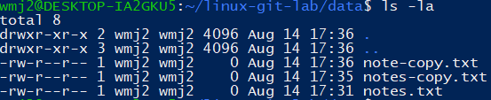
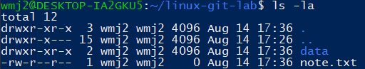
6. `cp`复制
`cp "当前目录下的文件" "目标目录下文件名"`
如上图所示，可以将文件复制到另外的路径下。
7. `mv`移动或重命名
```bash
mv notes-copy.txt new_name.txt
mv note-copy.txt ~/linux-git-lab/New_Name.txt
mv "当前路径下文件" "目标路径下文件(新文件名)"
```

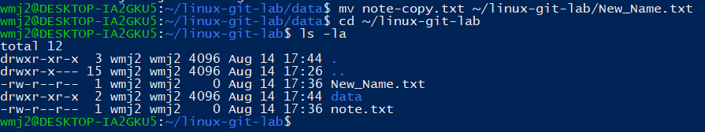
8. `find`按条件查找文件
`find`查找文件或目录
`.`查找的起始位置，"."表示当前目录
`-maxdepth 2`最多向下搜索两层
`-type f`只显示普通文件，`f`表示file
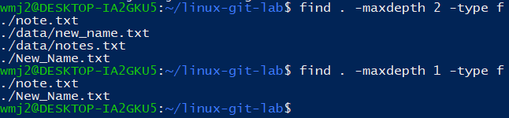
9.  `~`当前Linux用户的主目录
通常使用`cd ~`

## 文件权限
学习以下常用命令：
```bash
cd ~/linux-git-lab
touch test.sh
ls -l test.sh
chmod u+x test.sh
ls -l test.sh
```
运行上述命令后结果如下
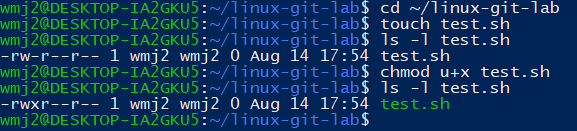
`ls -l`查看文件的权限
注意到`test.sh`文件的权限从`-rw-r--r--`变为`-rwxr--r--`。
其中
- `r`读取
- `w`写入
- `x`执行
三组权限分别对应“所有者”、“用户组”和“其他用户”
`chmod u+x`给所有者增加执行权限。
`u`所有者
`g`用户组
`o`其他用户
`a` = `ugo`全体成员
添加权限用`+`，删除权限用`-`

## 进程
1. `ps`：查看当前终端中与你有关的进程
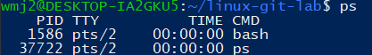
2. `ps aux`：查看系统中更完整的进程列表，`a`显示其他用户及其他终端中的进程；`u`使用面向用户的详细格式；`x`显示没有关联终端的后台进程。
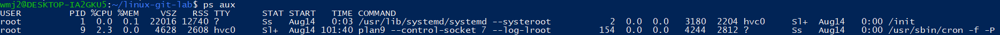
3. `sleep 300 &`：让程序等待300s，用于模拟一个持续运行的进程，如果不加`&`让命令在后台运行，而是直接运行，终端会等待300s，期间不能输入下一条命令，可以用`Ctrl+C`提前终止
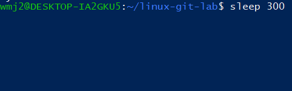
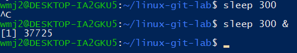
4. `jobs`：查看当前终端气动的后台或暂停作业，只管理当前shell气动的作业，不会显示系统中的全部进程。
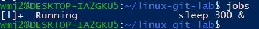
5. `pgrep sleep`：根据进程名称查找PID
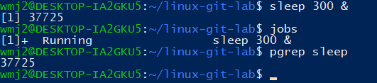
6. `kill`：终止进程`kill PID`向对应PID的进程发送终止信号，`kill %1`按作业编号退出
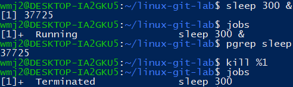
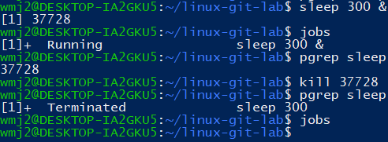

## 管道与重定向
```bash
ps aux | head
ps aux | sort -rk 3 | head
history | tail -n 10
printf "px4\nlinux\ngit\n" > topics.txt
cat topics.txt
grep "px4" topics.txt
wc -l topics.txt
```
`命令A | 命令B`表示将A的输出交给B继续处理
1. `>`覆盖写入文件
2. `>>`追加写入文件
3. `greb`筛选文本
4. `sort`排序
5. `head`查看开头
6. `tail`查看结尾
7. ‘`wc -l`统计行数

`ps aux | head`查看进程开头
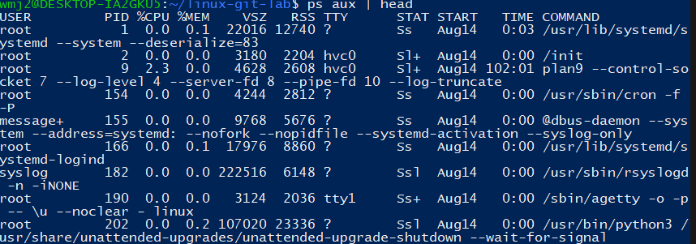

`ps aux | sort -rk 3 | head`
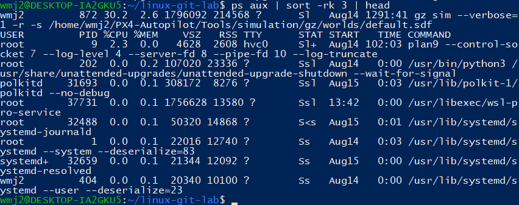

`history | tial -n 10`显示后十条（最近十条）操作命令
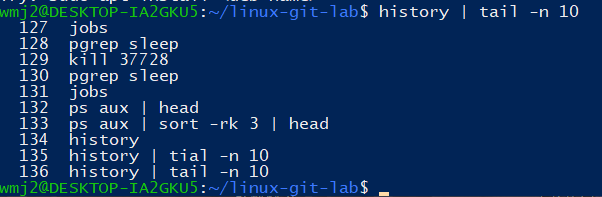

`printf`写入，`cat`读取
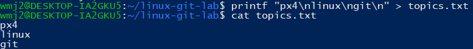

`grep "px4" topics.txt`在topics.txt文件中筛选“px4”字符

`wc -l topics.txt`统计文件topics.txt的行数

## 环境变量
```bash
echo "$HOME"
echo "$PATH"
export PX4_HOME="$HOME/PX4-Autopilot"
echo "$PX4_HOME"
env | grep PX4
```
`export`设置的变量只在当前终端及其子进程中有效，关闭终端后消失
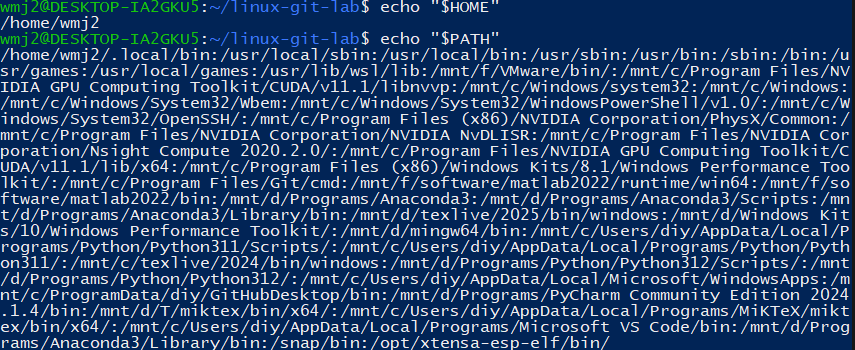
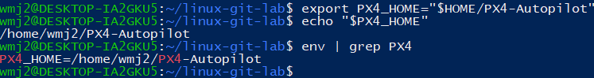

## SSH基础
```bash
ssh -V
ls -la ~/.ssh
```
SSH用于安全登录远程Linux机器，也可用于GitHub身份认证
私钥文件不能发给别人，也不要提交到GitHub仓库
暂不生成私钥文件
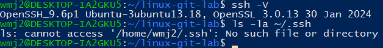