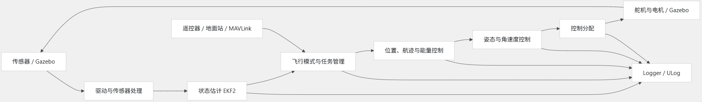

# PX4数据流
## 总体架构介绍
PX4 数据流可以理解成一条持续循环的链路：

其核心机制是**uORB消息总线**。
PX4的内部模块通常不会直接相互调用，而是发布和订阅消息，并且具有以下特征：
* 发布者不知道谁会使用数据
* 订阅者读取自己所需的最新数据
* 同一份状态可以同时供控制器、日志系统和MAVLink使用
* 模块之间因此更容易替换、测试和记录
例如，姿态估计器发布飞机姿态，姿态控制器、地面站通信模块和日志模块都可以分别订阅。

## 分模块解析
1. 传感器输入
真实飞机的数据来自：

|传感器|接收信息|
|:-----:|:-----:|
|IMU|角速度和加速度|
|磁力计|航向参考|
|气压计|气压高度|
|GPS|位置和地速|
|空速计|相对空气速度|

在SITL中，这些测量由Gazebo根据飞机模型和环境测算，再送给PX4。
对PX4上层算法来说，这些可以充当真实传感器数据。

原始数据经过校准、滤波、时间同步和一致性检查，最终形成供估计器使用的传感器消息。

2. 状态估计
EKF2 将多个传感器融合成控制器需要的状态，例如：姿态和四元数、角速度、NED坐标系下的位置和速度、高度、风速估计、传感器偏置、状态是否有效、

要注意区分“测量”和“估计”
   1. GPS给出带噪声、低频的位置测量
   2. IMU给出高频运动测量，但积分会偏移
   3. EKF2将这些数据融合，输出连续、相对稳定的状态估计
控制器主要使用状态估计，而不是使用原始GPS或IMU。
状态估计是对传感器原始数据的处理，使控制器能得到更接近实际情况的状态信号。

3. 飞行模式和设定值
飞行模式决定飞机当前应该做什么。命令可能来自：
    - 遥控器
    - 地面站
    - 自动任务
    - Offboard程序
    - 失效保护逻辑
这些输入最终转化为不同层级的设定值：
   - 目标位置
   - 目标航迹
   - 目标高度和空速
   - 目标滚转角、俯仰角
   - 目标角速度
   - 目标执行器输出
因此，“飞到某一个航点”不会直接变成舵机PWM，而是逐层转换。

4. 固定翼级联控制
固定翼自动飞行大致经过以下过程：
   1. 目标航点
   2. 目标航迹、转弯方向和高度
   3. 目标滚转角、俯仰角、空速和推力
   4. 目标滚转、俯仰、偏航角速度
   5. 滚转、俯仰、偏航控制量
   6. 副翼、升降舵、方向舵和油门
其中常见的两个关键概念为：
   1. 横向航迹引导：根据航线偏差和航向关系计算期望滚转，控制飞机转向
   2. TECS(Total Energy Control System)：协调俯仰和油门，管理高度与空速之间的能量分配
例如当飞机低于目标高度时，不能单一地一直拉升降舵，拉升会消耗空速，TECS需要结合油门、俯仰和可用能量决定如何爬升。

5. 控制分配与执行器
控制器通常输出的是抽象控制需求，例如：需要多少滚转力矩、需要多少俯仰力矩、需要多少偏航力矩、需要多少推力，控制分配模块再根据机体配置，把它们映射为：
- 左右副翼
- 升降舵
- 方向舵
- 油门
- 襟翼或其他执行器
在SITL中，这些输出返回Gazebo，Gazebo计算飞机下一时刻的运动；在真实飞行中，它们通过飞控输出接口发送给舵机和电调。

6. MAVLink、地面站与日志
**MAVLink不是PX4内部的主要消息总线**。其主要负责PX4与外部系统通信，如：
- 地面站上传任务和参数
- PX4发送姿态、位置和状态
- Offboard程序发送设定值
- 数传链路传递遥测信息
Logger则订阅重要的uORB消息写入ULog。
因此，分析ULog，本质上是在查看数据流各个阶段的输入和输出

### 一个具体例子

---

# 问题：
1. uORB消息总线是什么
2. SITL是什么
3. IMU
4. EKF2
5. 